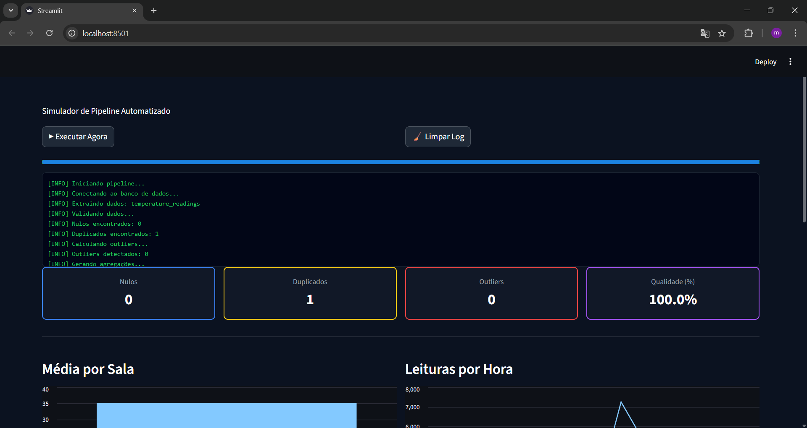
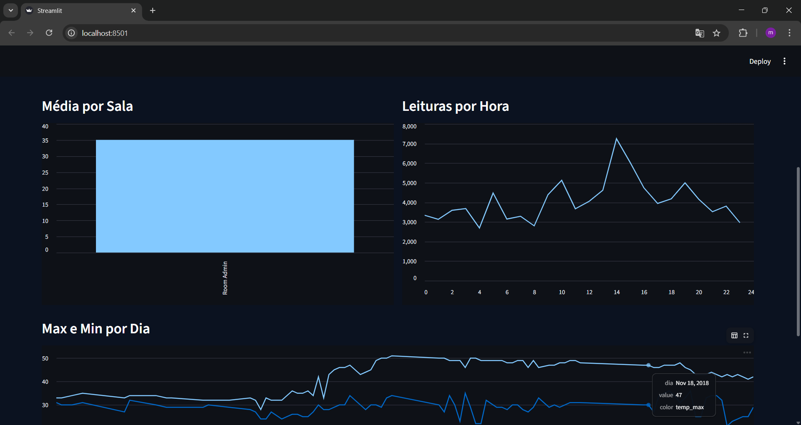
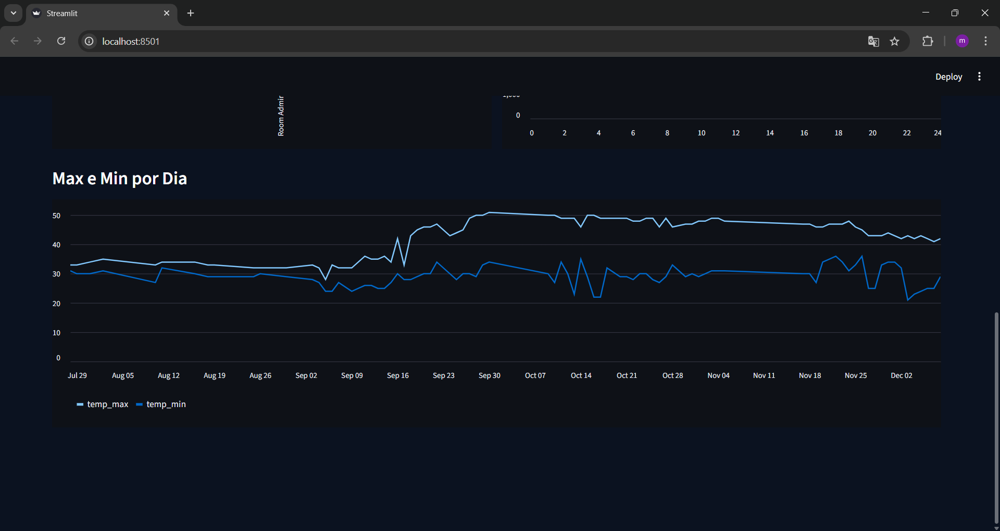

# Pipeline de Dados com IoT e Docker
Link github: https://github.com/mktechnologyweb/Pipeline-de-dados-IoT 
Link youtub: https://youtu.be/ZePU2CKss3g 

##  Descrição do Projeto

Este projeto tem como objetivo a construção de um **pipeline de dados completo** utilizando dados de dispositivos IoT (Internet das Coisas), com foco no processamento, armazenamento e visualização de leituras de temperatura.

O pipeline realiza as seguintes etapas:

*  Extração de dados de um arquivo CSV (Kaggle)
*  Tratamento e limpeza dos dados
*  Armazenamento em banco de dados PostgreSQL
*  Criação de views SQL para análise
*  Visualização interativa com Streamlit

---

##  Tecnologias Utilizadas

* Python 
* Pandas
* SQLAlchemy
* PostgreSQL
* Docker 
* Streamlit
* Plotly

---

##  Estrutura do Projeto

```
📦 pipeline-iot
 ┣ 📂 data
 ┃ ┗ 📄 IOT-temp.csv
 ┣ 📂 src
 ┃ ┣ 📄 etl.py
 ┃ ┗ 📄 dashboard.py
 ┣ 📂 docs
 ┃ ┗ 📄 imagens_dashboard.png
 ┣ 📄 docker-compose.yml
 ┣ 📄 requirements.txt
 ┗ 📄 README.md
```

---

##  Fonte de Dados

Dataset utilizado:

 Temperature Readings: IoT Devices (Kaggle)
https://www.kaggle.com/datasets/atulanandjha/temperature-readings-iot-devices

---

## ⚙️ Como Executar o Projeto

### 1. Clone o repositório

```bash
git clone https://github.com/seu-usuario/pipeline-iot.git
cd pipeline-iot
```

---

### 2. Suba o banco com Docker

```bash
docker-compose up -d
```

---

### 3. Instale as dependências

```bash
pip install -r requirements.txt
```

---

### 4. Execute o pipeline (ETL)

```bash
python src/etl.py
```

---

### 5. Execute o dashboard

```bash
streamlit run src/dashboard.py
```

---

##  Banco de Dados

O projeto utiliza PostgreSQL rodando via Docker.

### Configuração padrão:

* Host: localhost
* Porta: 5432
* Usuário: user
* Senha: password
* Banco: iot_db

---

##  Views SQL Criadas

### 1.  avg_temp_por_sala

Calcula a média de temperatura por sala.

```sql
SELECT "room_id/id" AS sala,
       AVG(temp) AS temperatura_media
FROM temperature_readings
GROUP BY "room_id/id";
```

---

### 2.  leituras_por_hora

Mostra a quantidade de leituras por hora.

```sql
SELECT EXTRACT(HOUR FROM noted_date) AS hora,
       COUNT(*) AS contagem
FROM temperature_readings
GROUP BY hora
ORDER BY hora;
```

---

### 3.  temp_max_min_por_dia

Apresenta temperatura máxima e mínima por dia.

```sql
SELECT DATE(noted_date) AS dia,
       MAX(temp) AS temp_max,
       MIN(temp) AS temp_min
FROM temperature_readings
GROUP BY dia;
```

---

##  Dashboard

O dashboard foi desenvolvido com Streamlit e apresenta:

*  Gráfico de média de temperatura por sala
*  Leituras por hora
*  Máximas e mínimas por dia
*  Análise de qualidade de dados:

  * Valores nulos
  * Duplicados
  * Outliers
  * Score de qualidade (%)

---

##  Principais Insights

* Identificação de horários com maior volume de leituras
* Variação de temperatura ao longo dos dias
* Detecção de valores fora do padrão (outliers)
* Avaliação da qualidade dos dados coletados

---

##  Qualidade de Dados

O sistema analisa automaticamente:

*  Valores nulos
*  Dados duplicados
*  Outliers (método IQR)
*  Score de qualidade dos dados

---

##  Prints do Projeto






---


##  Comandos Git Utilizados

```bash
git init
git add .
git commit -m "Projeto inicial: Pipeline IoT"
git branch -M main
git remote add origin URL_DO_REPOSITORIO
git push -u origin main
```

---

##  Autor

Desenvolvido por: **Mauricio Francesco**

---

##  Observações

Este projeto demonstra a aplicação prática de conceitos de:

* IoT (Internet das Coisas)
* Big Data
* Engenharia de Dados
* Visualização de Dados

---

##  Conclusão

O pipeline desenvolvido permite transformar dados brutos em informações úteis, possibilitando análise e tomada de decisão baseada em dados reais.

---
